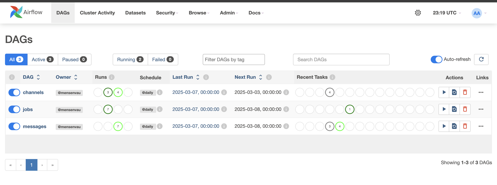
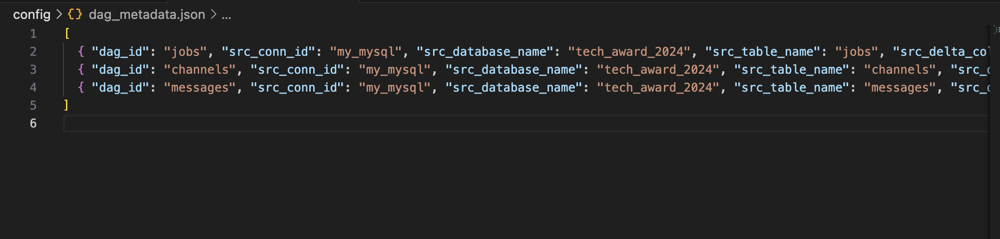

### Airflow Dynamic MySQL to S3

A powerful and dynamic MySQL-to-S3 pipeline designed for seamless data migration from **Jobgram.org** to S3. This robust solution can also be leveraged for various other data processing tasks.

#### Airflow (Initialization & Execution)

[Check the official documentation for more details](https://airflow.apache.org/docs/apache-airflow/stable/howto/docker-compose/index.html).

```bash
docker compose up airflow-init
```

```bash
docker compose up -d
```

#### S3 (MinIO) Setup

```bash
mkdir -p ~/minio/data

docker run \
   -p 9000:9000 \
   -p 9001:9001 \
   --name minio \
   -v ~/minio/data:/data \
   -e "MINIO_ROOT_USER=ROOTNAME" \
   -e "MINIO_ROOT_PASSWORD=CHANGEME123" \
   quay.io/minio/minio server /data --console-address ":9001"
```

### Examples

#### DAGs Example



#### Metadata Example



#### S3 Bucket Example


### Recommended Watch

[Watch this YouTube video for more insights](https://www.youtube.com/watch?v=K9AnJ9_ZAXE)

### Join Our Telegram Channel

Stay updated by joining our Telegram channel: [@mensenvau](https://t.me/mensenvau)
